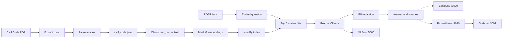

# Egypt Law RAG

Retrieval-augmented question answering over the Egyptian Civil Code. A question is embedded, matched against article chunks, and answered from those chunks by a language model. Repealed articles stay in the corpus and are flagged. The original Arabic is kept beside a separate normalized field used for search.

The processed articles and the vector index are in git, so a clone can serve `/ask` without rebuilding the corpus. The source PDF is not in git. It lives in a DVC remote on the machine that extracted it (`D:/dvc-storage/egypt-law-rag`).

## What is built

- **Corpus.** `scripts/extract_rows.py` reads the PDF, `scripts/parse_rows.py` turns rows into articles, and `scripts/validate_corpus.py` checks them. Output is `data/processed/civil_code.json`. Each article has `article_number` (an integer), `text_ar`, `text_normalized`, and `repealed`.
- **Index.** Articles are split into chunks and embedded with `sentence-transformers/paraphrase-multilingual-MiniLM-L12-v2` (384 dimensions, CPU, via fastembed). Vectors are stored as `data/index/chunks.json` and `data/index/vectors.npy`. Search is cosine similarity in NumPy. A second model name, `minishlab/potion-multilingual-128M`, is available as `EMBEDDING_MODEL_ALT`.
- **API.** FastAPI serves `GET /health`, `GET /metrics`, and `POST /ask`. An empty question returns 422. `/ask` returns an answer plus citation strings. `"stream": true` streams the answer as plain text. Exact article lookups skip vector search. A repealed article gets a fixed repealed notice. National IDs (14 digits) and Egyptian mobile numbers are redacted to `[REDACTED]`.
- **Generator.** The default backend is Groq (`qwen3.8-27b`). Set `GENERATOR_BACKEND=ollama` to use a local `qwen2.5:0.5b` instead. vLLM is not used.
- **BentoML.** The same ask path is an async service: `bentoml serve egylaw_rag.serving.service:CivilCodeRag`.
- **Evaluation.** Twenty CI questions and fifty full-set questions live in `data/eval/`. Scores are faithfulness, answer relevancy, context precision, and context recall, plus hit@k and MRR. Retrieval depth for that check is 16. CI runs `scripts/check_faithfulness.py` and fails when faithfulness is under 0.75. On the committed index the 20-question faithfulness is 0.825 and the 50-question faithfulness is 0.840. `scripts/run_ragas.py` stores the four 50-question metrics in MLflow. If `ALERT_WEBHOOK_URL` is set, a Discord-style message is sent when faithfulness is under 0.80.
- **MLflow.** Chunk-size experiments log `chunk_size`, `overlap`, `embedding_model`, `text_field=text_normalized`, and faithfulness. The winning config is registered as `best-chunking-config`.
- **Observability.** With Langfuse keys set, each `/ask` is a trace with retrieve and generate spans and a faithfulness score. Query drift is the cosine between the question embedding and the mean index vector. Prometheus scrapes token counts. Grafana prices them at 0.05 USD per 1,000 tokens (a documented stand-in, not a live invoice).
- **Load test.** `locustfile.py` sends 50 concurrent users at `POST /ask`. `scripts/stub_api.py` is a local API with no model call. The stub run is in `reports/locust_50.html`: 3,911 requests, 0 failures, average about 11 ms, p99 about 130 ms.
- **CI.** GitHub Actions lints, tests, rebuilds the index, fails on low faithfulness, and builds the Docker image with that index inside it.

## Architecture



`/ask` retrieves 5 chunks. The faithfulness gate retrieves 16 so more of the gold article is in context.

Docker Compose starts two services with no extra flags:

| Service | Port | Role |
|---|---|---|
| `egylaw-rag` | 8000 | API, index baked into the image |
| `mlflow` | 5000 | Tracking UI, sqlite in `reports/mlflow` |

Optional profiles:

| Profile | Services | Ports | Data on disk |
|---|---|---|---|
| `llm` | Ollama | 11434 | `data/ollama` |
| `observability` | Langfuse, Postgres, Prometheus, Grafana | 3000, 9090, 3001 | `data/langfuse-db`, `data/prometheus`, `data/grafana` |

Image layers still go to Docker Desktop’s disk. On this machine that disk is partition C:. Bind-mounted data stays in the project directory.

## Clone and run

Requirements: Git, [uv](https://docs.astral.sh/uv/), Python 3.11, and a Groq API key for answers. Docker is only needed for the Compose path.

```powershell
git clone https://github.com/anasfathysalama/egypt-law-rag.git
cd egypt-law-rag
uv sync
copy .env.example .env
```

Put the Groq key in `.env`:

```
GROQ_API_KEY=your-key
```

Start the API:

```powershell
uv run python scripts/serve.py
```

Ask a question:

```powershell
Invoke-RestMethod -Method Post -Uri http://127.0.0.1:8000/ask `
  -ContentType "application/json" `
  -Body '{"question":"What does the contract say?"}'
```

Health check:

```powershell
Invoke-RestMethod http://127.0.0.1:8000/health
```

Stream the answer by sending `"stream": true`. The body comes back as plain text.

### Docker

From the repo root, with the same `.env` if you want Groq inside the container:

```powershell
docker compose up -d --build
```

- API: http://127.0.0.1:8000/health
- MLflow: http://127.0.0.1:5000

Ollama, Langfuse, Prometheus, and Grafana do not start with that command. They are behind profiles:

```powershell
docker compose --profile llm --profile observability up -d
docker compose exec ollama ollama pull qwen2.5:0.5b
```

Then set this in `.env` and recreate the API container:

```
GENERATOR_BACKEND=ollama
OLLAMA_API_BASE=http://ollama:11434/v1
```

`OLLAMA_API_BASE` must be `http://ollama:11434/v1` inside Compose. On the host, without Compose, it stays `http://127.0.0.1:11434/v1`.

Langfuse is http://127.0.0.1:3000. Prometheus is http://127.0.0.1:9090. Grafana is http://127.0.0.1:3001 (user `admin`, password `admin`). Create a Langfuse project, copy the public and secret keys into `.env` as `LANGFUSE_HOST`, `LANGFUSE_PUBLIC_KEY`, and `LANGFUSE_SECRET_KEY`, then restart the API. Until those are set, traces stay in memory.

Stop everything:

```powershell
docker compose --profile llm --profile observability down
```

## Tests and eval

```powershell
uv run ruff check .
uv run pytest
uv run python scripts/check_faithfulness.py
uv run python scripts/run_ragas.py
```

`check_faithfulness.py` exits non-zero when faithfulness is under 0.75. `run_ragas.py` writes the 50-question run to MLflow at `MLFLOW_TRACKING_URI`, or to `reports/mlflow/mlflow.db` when port 5000 is closed.

Load test against the stub (no Groq calls):

```powershell
uv run python scripts/stub_api.py
```

In another terminal:

```powershell
uv run locust -f locustfile.py --headless -u 50 -r 50 -t 15s --host http://127.0.0.1:8099 --html reports/locust_50.html
```

BentoML:

```powershell
uv run bentoml serve egylaw_rag.serving.service:CivilCodeRag
```

## Rebuild the corpus

Only on a machine that has the PDF in the DVC remote:

```powershell
uv run dvc pull
uv run dvc repro
```

`dvc repro` runs extract, parse, validate, and index. The JSON and the index are `cache: false`, so git keeps those files. The PDF and `data/interim/raw_rows.json` stay in the DVC cache.

Chunking comparison, after MLflow is up:

```powershell
uv run python scripts/compare_chunking.py
```

## Layout

```
src/egylaw_rag/    API, corpus, index, eval, tracing, metrics
tests/             pytest
scripts/           extract, index, serve, eval, stub
data/processed/    civil_code.json
data/index/        chunks and vectors
data/eval/         question sets
observability/     Prometheus and Grafana config
reports/           load-test report and MLflow sqlite
```

Tooling is uv only (`uv add`, `uv run`). Do not `pip install`.
